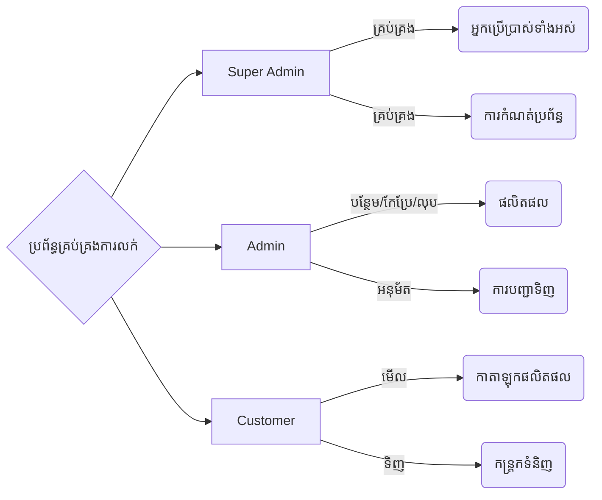
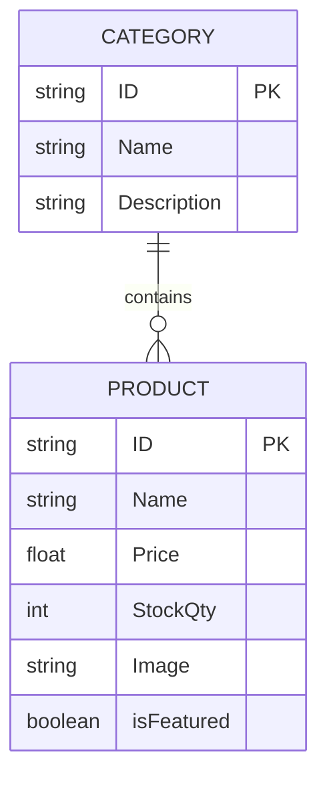
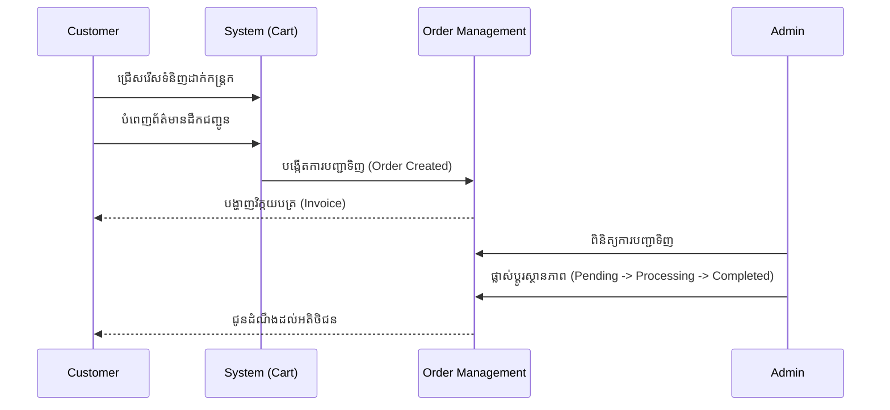
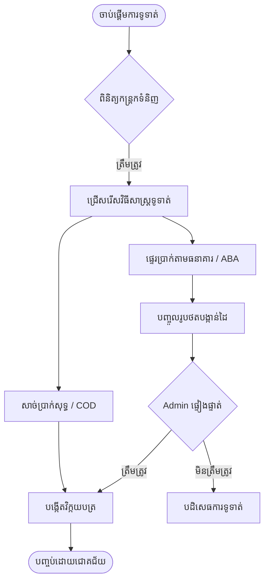
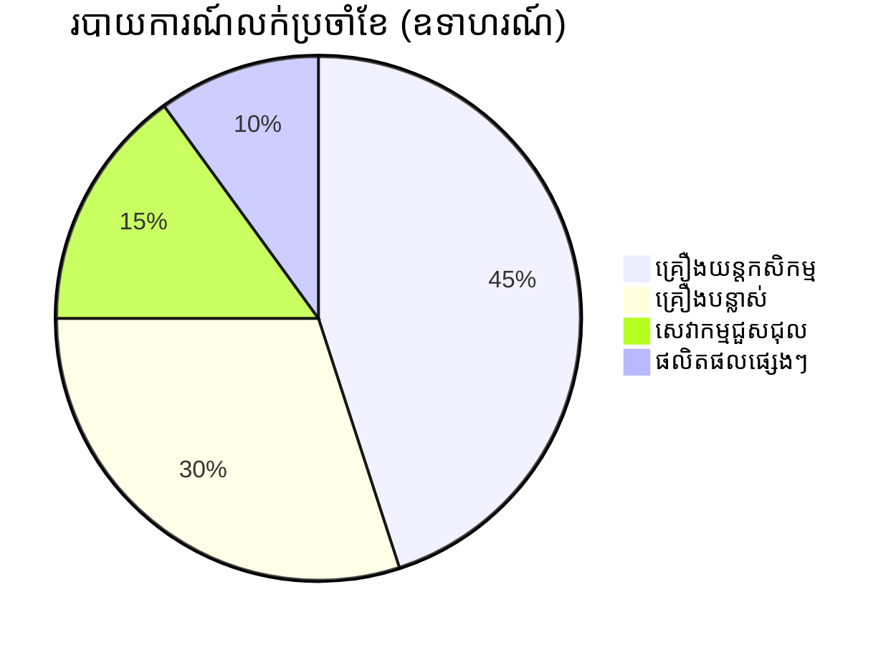

# គ.១ រចនាសម្ព័ន្ធនៃប្រព័ន្ធគ្រប់គ្រងការលក់ (System Structure)
```mermaid
graph TD
    User([អតិថិជន / អ្នកប្រើប្រាស់]) -->|ចូលប្រើប្រាស់| FE[Front-End (Next.js)]
    Admin([អ្នកគ្រប់គ្រង / Admin]) -->|គ្រប់គ្រង| FE
    
    FE <-->|API Requests| BE[Back-End (Node.js & Express)]
    BE <-->|Prisma ORM| DB[(PostgreSQL Database)]
    BE <-->|Uploads| Cloud[Cloudinary / Storage]
    
    style FE fill:#004691,stroke:#fff,stroke-width:2px,color:#fff
    style BE fill:#10b981,stroke:#fff,stroke-width:2px,color:#fff
    style DB fill:#f59e0b,stroke:#fff,stroke-width:2px,color:#fff
```

# គ.២ តួនាទីរបស់អ្នកប្រើប្រាស់ និងការអនុញ្ញាត (User Roles & Permissions)


# គ.៣ ព័ត៌មានផលិតផល និងស្តុកទំនិញ (Products & Stock)


# គ.៤ ការគ្រប់គ្រងអតិថិជន និងការបញ្ជាទិញ (Customer & Orders)


# គ.៥ ការទូទាត់ប្រាក់ និងវិក្កយបត្រ (Payment & Invoice)


# គ.៦ របាយការណ៍លក់ និងចំណូល (Sales & Revenue Reports)

